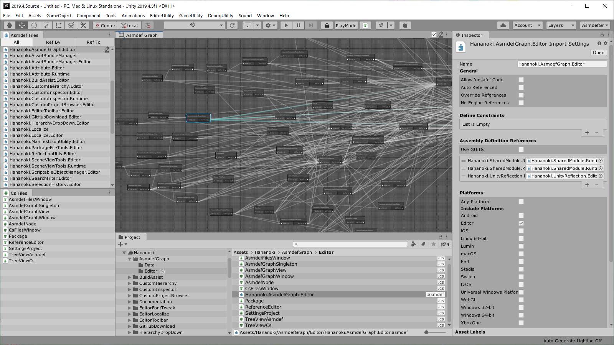

# AsmdefGraph


## Overview
- Check Asmdef in GraphView



## Installation
- Add following lines to the `dependencies` section of the `Packages/manifest.json`.
```js
"dependencies": {
  "com.hananoki.asmdef-graph": "https://github.com/hananoki/AsmdefGraph.git",
  "com.hananoki.shared-module": "https://github.com/hananoki/SharedModule.git",
  ...
}
```

## Requirement
[](https://github.com/hananoki/SharedModule)

## Licence
[MIT](https://github.com/hananoki/AsmdefGraph/blob/master/LICENSE.md)